<!--
  Сен мұны оқып отырсың ба? Керемет. (You're reading the source? Nice.)
  Everything below is generated by scripts/generate.mjs: hand-written SVG,
  no dependencies, refreshed daily by GitHub Actions from live data.
-->

<a href="https://me-steppe.vercel.app">
  
</a>

  <a href="https://me-steppe.vercel.app"><b>me.steppe.run</b></a>&nbsp;&nbsp;·&nbsp;&nbsp;
  <a href="https://onsteppe.vercel.app"><b>OnSteppe studio</b></a>&nbsp;&nbsp;·&nbsp;&nbsp;
  <a href="#guestbook"><b>leave a star ✦</b></a>


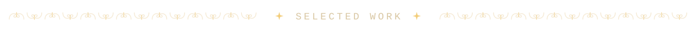

  
  
  <a href="https://github.com/nunmer/qaida"></a>
  <a href="https://qala-code.vercel.app"></a>
  <a href="https://me-steppe.vercel.app"></a>
  <a href="https://github.com/nunmer/steperun"></a>
  <a href="https://github.com/nunmer/tanba"></a>
  <a href="https://github.com/nunmer/speechkit"></a>

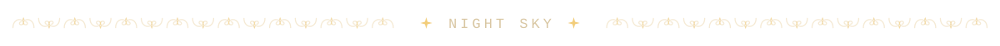


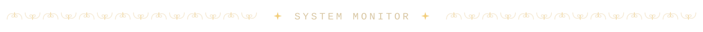


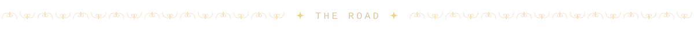


<b>Older caravans</b> (2021–2024 archive)

 

| year | project | what |
|---|---|---|
| 2024 | [gpstracker](https://github.com/nunmer/gpstracker) · [ecoshop](https://github.com/nunmer/ecoshop) | IoT tracking, e-commerce |
| 2023 | [BaigeCode-front](https://github.com/nunmer/BaigeCode-front) · [car-brands](https://github.com/nunmer/car-brands) | frontends, image classification |
| 2022 | [Decentralized-Exchange](https://github.com/nunmer/Decentralized-Exchange) · [NFT-Collection](https://github.com/nunmer/NFT-Collection) · [ENS](https://github.com/nunmer/ENS) | web3 dapps |
| 2022 | [roommate.kz](https://github.com/nunmer/roommate.kz) · [loadtesting](https://github.com/nunmer/loadtesting) | Java services, load testing |
| 2021 | [OOP](https://github.com/nunmer/OOP) · [aktobe.github.io](https://github.com/nunmer/aktobe.github.io) | first steps |

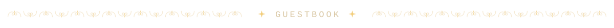

  
   
  Open the issue and submit it. A bot writes your handle into the sky within a minute and then closes the issue.


Hand-drawn SVG · regenerated daily by <a href=".github/workflows/refresh.yml">GitHub Actions</a> · no third-party widgets

